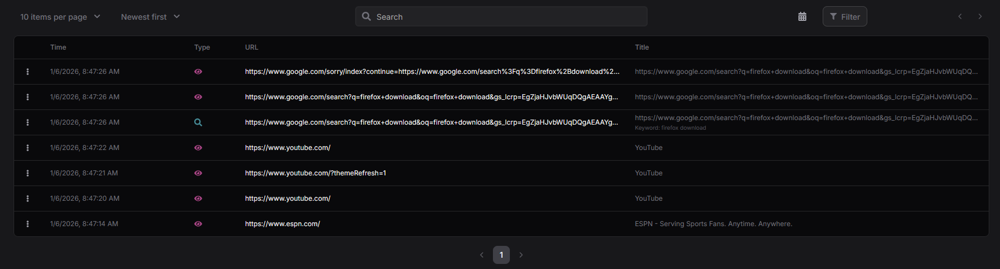

# webviewer



Client-side browser history analysis. Your data never leaves your browser.

## Features

- Parses SQLite history files in-browser using WebAssembly
- Supports Chrome, Firefox, and Edge
- Filter by date, event type, and search
- Send URLs to VirusTotal, URLScan, Browserling

## Usage

1. Copy your browser history file (rename to `.db` or `.sqlite`)
2. Upload at [viewer.websec.tools](https://viewer.websec.tools)
3. Browse, filter, and analyze

## Development

```bash
npm install
npm run dev
```
